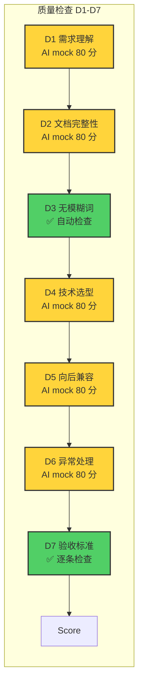

# Designing 环节完整流程图

> **版本**: v3.1.14  
> **最后更新**: 2026-04-07  
> **Commit**: 5f1681b

---

## 主流程图

```mermaid
flowchart TD
    Start([开始]) --> Init[初始化 ReviewDesignAgentV2]
    
    Init --> FG{执行 Freshness Gate}
    
    FG -->|FG 失败 ❌| Reject1([驳回<br/>哈希不匹配])
    FG -->|FG 通过 ✅| TG{执行 Traceability Gate}
    
    TG -->|TG 失败 ❌| Reject2([驳回<br/>需求未映射])
    TG -->|TG 通过 ✅| QC[执行质量检查 D1-D7]
    
    QC --> Calc[计算综合评分]
    
    Calc --> Decision{综合评分}
    Decision -->|>=90| Pass([✅ 通过])
    Decision -->|70-89| Conditional([⚠️ 条件通过])
    Decision -->|<70| Fail([❌ 驳回])
    
    Reject1 --> Fail
    Reject2 --> Fail
    
    classDef gate fill:#ff6b6b,stroke:#333,stroke-width:2px;
    classDef check fill:#51cf66,stroke:#333,stroke-width:2px;
    classDef mock fill:#ffd43b,stroke:#333,stroke-width:2px;
    classDef decision fill:#339af0,stroke:#333,stroke-width:2px;
    classDef end fill:#868e96,stroke:#333,stroke-width:2px;
    
    class FG,TG gate;
    class D3,D7 check;
    class D1,D2,D4,D5,D6 mock;
    class Decision decision;
    class Pass,Conditional,Fail,Reject1,Reject2 end;
```

---

## Freshness Gate 详细流程 (v3.1.12)

```mermaid
flowchart TD
    FG_Start([Freshness Gate]) --> FG1[计算 REQUIREMENTS.md<br/>SHA256 哈希]
    
    FG1 --> FG2[提取 PRD.md 声明哈希<br/>正则：a-f0-9]{7,64}]
    FG2 --> FG3{PRD 有哈希声明？}
    
    FG3 -->|无 ❌| FG_Reject1([驳回<br/>PRD 未声明哈希])
    FG3 -->|有 ✅| FG4[提取 TRD.md 声明哈希<br/>正则：a-f0-9]{7,64}]
    
    FG4 --> FG5{TRD 有哈希声明？}
    FG5 -->|无 ❌| FG_Reject2([驳回<br/>TRD 未声明哈希])
    FG5 -->|有 ✅| FG6{哈希对比<br/>requirementsActualHash<br/>.startsWith<br/>declaredHash}
    
    FG6 -->|PRD✅ TRD✅| FG_Pass([✅ FG 通过])
    FG6 -->|PRD❌ 或 TRD❌| FG_Reject3([驳回<br/>哈希不匹配<br/>提示：更新为前 7-64 位])
    
    classDef gate fill:#ff6b6b,stroke:#333,stroke-width:2px;
    classDef check fill:#51cf66,stroke:#333,stroke-width:2px;
    classDef decision fill:#339af0,stroke:#333,stroke-width:2px;
    classDef end fill:#868e96,stroke:#333,stroke-width:2px;
    
    class FG6 decision;
    class FG_Pass check;
    class FG_Reject1,FG_Reject2,FG_Reject3 end;
```

**支持的哈希声明格式**：
```markdown
✅ > **对齐版本**: REQUIREMENTS v3.1.12 (9f02132d0cf5)        ← 12 位
✅ > **对齐版本**: REQUIREMENTS v3.1.12 (9f02132d0cf5db3a...) ← 64 位
✅ | 对齐版本 | REQUIREMENTS v3.1.12 |
   | 对齐哈希 | 9f02132d0cf5 |
❌ > **对齐版本**: REQUIREMENTS v3.1.12                       ← 无哈希
❌ > **对齐版本**: REQUIREMENTS v3.1.12 (9f0213)              ← 少于 7 位
```

---

## Traceability Gate 详细流程 (v3.1.13)

```mermaid
flowchart TD
    TG_Start([Traceability Gate]) --> TG1[提取 REQUIREMENTS.md<br/>所有需求 REQ-001 ~ REQ-N]
    
    TG1 --> TG2[遍历每条需求]
    TG2 --> TG3[在 PRD.md 中查找映射]
    
    TG3 --> TG4{匹配模式<br/>^#{1,6}.*\\[REQ-xxx\\]<br/>^#{1,6}\\s*REQ-xxx[:：]<br/>^[-*]\\s*\\[REQ-xxx\\]}
    
    TG4 -->|未找到 ❌| TG5[标记：未映射]
    TG4 -->|找到 ✅| TG6{验证证据关键词<br/>功能 | 验收 | Given<br/>字段 | 流程 | 接口 | UI}
    
    TG6 -->|无证据 ❌| TG7[跳过并记录 warning<br/>找到 REQ-xxx 但缺少证据]
    TG6 -->|有证据 ✅| TG8[标记：已映射]
    
    TG5 --> TG9{所有需求<br/>已映射？}
    TG7 --> TG9
    TG8 --> TG9
    
    TG9 -->|100% ✅| TG_Pass([✅ TG 通过])
    TG9 -->|<100% ❌| TG_Reject([驳回<br/>列出未映射需求])
    
    classDef gate fill:#ff6b6b,stroke:#333,stroke-width:2px;
    classDef check fill:#51cf66,stroke:#333,stroke-width:2px;
    classDef decision fill:#339af0,stroke:#333,stroke-width:2px;
    classDef end fill:#868e96,stroke:#333,stroke-width:2px;
    
    class TG4,TG6,TG9 decision;
    class TG_Pass check;
    class TG_Reject end;
```

**命中示例**：
```markdown
✅ ### 2.1 用户注册功能 [REQ-001]        ← 标题 + 方括号
   功能描述：用户可以通过邮箱注册账号     ← 证据：功能描述
   验收标准：Given 用户未注册...          ← 证据：Given

❌ | REQ-001 | 2.1 | ✅ 已映射 |         ← 追溯表，无证据关键词
❌ 参见 REQ-001                          ← 引用，不是标题
```

---

## D7 验收标准详细流程 (v3.1.12)

```mermaid
flowchart TD
    D7_Start([D7 验收标准检查]) --> D7_1[遍历 REQUIREMENTS<br/>每条需求]
    
    D7_1 --> D7_2[查找 PRD.md<br/>映射章节]
    D7_2 --> D7_3{检查结构化标记<br/>Given\\s*[:：]<br/>When\\s*[:：]<br/>Then\\s*[:：]}
    
    D7_3 -->|有冒号 ✅| D7_ItemPass[该项通过]
    D7_3 -->|无冒号 ❌| D7_4{检查宽松模式<br/>^Given\\b<br/>^When\\b<br/>^Then\\b}
    
    D7_4 -->|有换行 ✅| D7_ItemPass
    D7_4 -->|无换行 ❌| D7_ItemFail[该项失败]
    
    D7_ItemPass --> D7_5[记录：通过]
    D7_ItemFail --> D7_6[记录：失败<br/>缺失 Given/When/Then]
    
    D7_5 --> D7_7{所有需求<br/>遍历完成？}
    D7_6 --> D7_7
    
    D7_7 -->|否 | D7_1
    D7_7 -->|是 | D7_8{计算通过率<br/>passedCount / total}
    
    D7_8 -->|>=80% ✅| D7_Pass([✅ D7 通过])
    D7_8 -->|<80% ❌| D7_Fail([❌ D7 失败<br/>列出缺失需求])
    
    classDef check fill:#51cf66,stroke:#333,stroke-width:2px;
    classDef decision fill:#339af0,stroke:#333,stroke-width:2px;
    classDef end fill:#868e96,stroke:#333,stroke-width:2px;
    
    class D7_3,D7_4,D7_8 decision;
    class D7_Pass check;
    class D7_Fail end;
```

**通过示例**：
```markdown
✅ 前置条件：用户未注册        ← 结构化标记（带冒号）
   触发条件：填写注册表单
   预期结果：创建账号并发送验证邮件

✅ 【前置条件】用户未登录      ← 结构化标记（【】括号）
   【触发条件】访问受保护资源
   【预期结果】重定向到登录页

❌ 当用户打开页面时，系统应该加载数据  ← 单字"当"，误判（已修复）
```

---

## 质量检查总览



**当前真正生效的检查**：
- ✅ **FG Freshness Gate** - 强门禁（支持 7-64 位哈希）
- ✅ **TG Traceability Gate** - 强门禁（标题 + 证据关键词）
- ✅ **D3 无模糊词** - 自动检查（检测"适当的"/"一些"/"可能"）
- ✅ **D7 验收标准** - 逐条检查（结构化标记）
- ⚠️ **D1/D2/D4/D5/D6** - AI mock（固定 80 分，未实现）

---

## 评分决策规则

```mermaid
flowchart TD
    Start[Gate 检查完成] --> GateFail{FG 或 TG 失败？}
    
    GateFail -->|是 ❌| GateReject([直接驳回<br/>score=0])
    GateFail -->|否 ✅| Calc[计算质量分]
    
    Calc --> AvgScore{平均分}
    AvgScore -->|>=90| Pass1([✅ 通过<br/>score=90-100])
    AvgScore -->|70-89| Conditional([⚠️ 条件通过<br/>score=70-89<br/>记录待修复项])
    AvgScore -->|<70| Reject([❌ 驳回<br/>score=0-69<br/>重新生成])
    
    classDef gate fill:#ff6b6b,stroke:#333,stroke-width:2px;
    classDef check fill:#51cf66,stroke:#333,stroke-width:2px;
    classDef decision fill:#339af0,stroke:#333,stroke-width:2px;
    classDef end fill:#868e96,stroke:#333,stroke-width:2px;
    
    class GateFail decision;
    class GateReject,Reject end;
    class Pass1,Conditional check;
```

---

## v3.1.x 修复对流程图的影响

| 版本 | 修复环节 | 流程图变化 |
|------|---------|-----------|
| v3.1.9 | FG / TG / D7 | 新增 Freshness Gate 哈希校验、TG 需求 ID 正则、D7 逐条检查 |
| v3.1.10 | TG | TG 匹配模式增加 `REQ-001:` 冒号格式 |
| v3.1.11 | FG / TG | FG 哈希格式修复、TG 映射匹配修复 |
| v3.1.12 | FG / D7 | **FG 支持 7-64 位短哈希**、**D7 结构化标记**、AI mock 标记 |
| v3.1.13 | TG | **TG 要求证据关键词**、version 取最新 |
| v3.1.14 | 整体 | 删除旧 review-design.js，统一使用 v2 |

---

## 完整执行路径示例

### 场景 1: 完全通过

```
开始
  ↓
初始化 ReviewDesignAgentV2
  ↓
Freshness Gate: PRD(9f02132d0cf5) ✅ TRD(9f02132d0cf5) ✅
  ↓
Traceability Gate: 13/13 需求已映射 ✅
  ↓
质量检查:
  D1: 80 (mock)
  D2: 80 (mock)
  D3: 100 (自动检查无模糊词)
  D4: 80 (mock)
  D5: 80 (mock)
  D6: 80 (mock)
  D7: 100 (13/13 需求有 Given/When/Then)
  ↓
综合评分：(80+80+100+80+80+80+100)/7 = 85.7
  ↓
决策：70-89 → 条件通过 ⚠️
  ↓
输出报告：条件通过，建议实现 AI 检查提升分数
```

### 场景 2: Freshness Gate 失败

```
开始
  ↓
初始化 ReviewDesignAgentV2
  ↓
Freshness Gate:
  REQUIREMENTS 实际哈希：9f02132d0cf5db3a614aa260cfa2be16efc6232d0e3ca58c3fa401cf0dd0fcc8
  PRD 声明哈希：abc123  ← 只有 6 位，少于 7 位
  ↓
决策：哈希不匹配 → 驳回 ❌
  ↓
输出报告：请更新 PRD.md 的哈希声明为实际值的前 7-64 位：9f02132d0cf5...
```

### 场景 3: Traceability Gate 失败

```
开始
  ↓
初始化 ReviewDesignAgentV2
  ↓
Freshness Gate: ✅ 通过
  ↓
Traceability Gate:
  REQ-001: ✅ 已映射 (### 2.1 功能 [REQ-001] + 功能描述)
  REQ-002: ✅ 已映射 (### 2.2 功能 [REQ-002] + 验收标准)
  REQ-003: ❌ 未映射 (PRD 中未找到 [REQ-003])
  ↓
可追溯率：2/3 = 66.7% < 100%
  ↓
决策：需求未完全映射 → 驳回 ❌
  ↓
输出报告：以下需求未映射：REQ-003: 审阅驱动 + 会话隔离
```

---

*文档 by openclaw-ouyp*  
**版本**: v3.1.14 | **日期**: 2026-04-07 | **Commit**: 5f1681b
